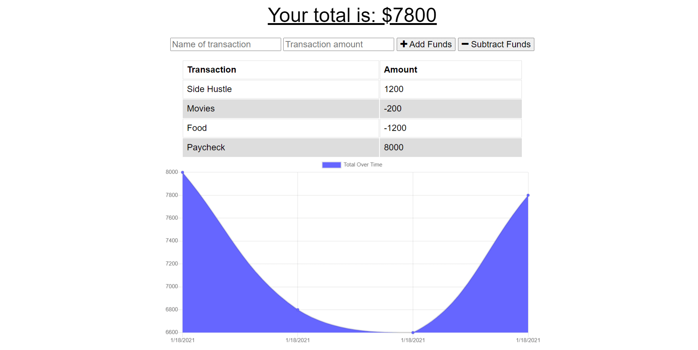

# PWA_Budget

## Description

This is a budget app that allows the user to keep track of their available funds whether they are online or offline and has a chart to help visualize where the money is allocated. The user never has to worry if they lose signal while using the app on their portable device.

## Table of Contents

-   [Installation Instructions](#installation-instructions)
-   [Usage Information](#usage-information)
-   [License](#license)
-   [Contribution Guidelines](#contribution-guidelines)
-   [Test Instructions](#test-instructions)
-   [Questions](#questions)

## Installation Instructions

This application requires Node.js which can be downloaded <a href="https://nodejs.org/en/" target="_blank">here</a>. It utilizes the folowing node modules <a href="https://www.npmjs.com/package/mongoose" target="_blank">mongoose</a>, <a href="https://www.npmjs.com/package/compression" target="_blank">compression</a>, <a href="https://www.npmjs.com/package/lite-server" target="_blank">lite-server</a>, <a href="https://www.npmjs.com/package/dotenv" target="_blank">dotenv</a>, <a href="https://www.npmjs.com/package/express" target="_blank">express</a>, <a href="https://www.npmjs.com/package/morgan" target="_blank">morgan</a> and can be installed using <a href="https://www.npmjs.com/" target="_blank">node package manager</a>. This app utilizes a <a href="https://www.mongodb.com/1" target="_blank">mongoDB</a> database either locally or server based.

## Usage Information

This app lets you keep track of your budget whether the user is offline or online, it utilizes the indexedDB built into the browser to store the transactions until the app is back online and then sends the transactions in the indexedDB database to the remote mongoDB atlas database for long term storage.

## License

This project is not utilizing a license

## Contribution Guidelines

This is a fully open source project, you may fork the repository and any pull requests will be viewed and implemented accordingly.

## Test Instructions

This application does not utilize tests

## Questions

If there are further questions please contact me with the following.

 AndrewMorrow <a href="https://github.com/AndrewMorrow" target= "_blank">Github</a>

Email: beardedmongo@gmail.com
